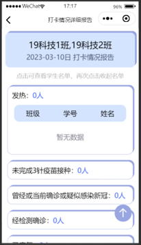

# 校园疫情防控管理微信小程序
该项目是基于`uniapp`开发的微信小程序，前端使用了uniapp框架，使用了`vuex`进行状态管理、使用`@escook/request-miniprogram`第三方包发起网络请求，后端使用了`nodejs`进行开发，数据库使用的是`MySQL`。

### 项目描述：
该项目设置了3个类型的用户：`学生`、`教师`、`管理员`。
包含的功能：
1. 学生用户的健康填报、返校或外出申请、返校或外出二维码、查看申请记录的功能。
2. 教师用户的班级学生管理功能、所管理班级学生健康填报情况查看功能、审批学生的返校或外出申请的功能。
3. 管理员的用户管理功能、学院专业班级管理功能、发布和管理公告和资讯功能、查看全校学生健康填报情况以及申请记录。
4. 登录用户可编辑个人信息、更换头像、查看公告和资讯，未登录用户只能查看公告和资讯。

### 说明
前端项目`uni-epidemic`的main.js文件中配置请求根路径
`$http.baseUrl = 'http://xxx.xxx.xx.xxx:5000'`中的ip为电脑的网络ip，需根据实际情况进行更改。

### 项目展示
1. 小程序不同用户登录显示不同功能选项
未登录用户首页、个人中心页面：
  
点击个人中心页面的一键登录按钮进入登录页面：
  
学生用户登录后首页、个人中心页面：
   
教师用户登录后首页、管理员登录后首页：
    
2. 登录用户编辑个人信息、更换头像、修改密码
    
3. 学生健康打卡记录显示功能和打卡页面
    
4. 学生返校外出申请功能、显示申请记录页面、查看或删除申请记录功能、生成返校/外出申请审批通过的二维码
    
    
5. 教师用户审批申请页面
    
6. 教师用户管理的班级学生打卡情况页面、打卡情况详细报告页面
    
7. 教师用户增、删、搜索管理班级学生
    
8. 管理员发布、删除、修改、搜索公告和资讯
    
    
9. 管理员查看全校或某个学院打卡完成情况页面、各学院的申请审批记录页面
    
10. 管理员增、删、搜索用户、编辑用户信息功能、增删学院专业班级页面
    
